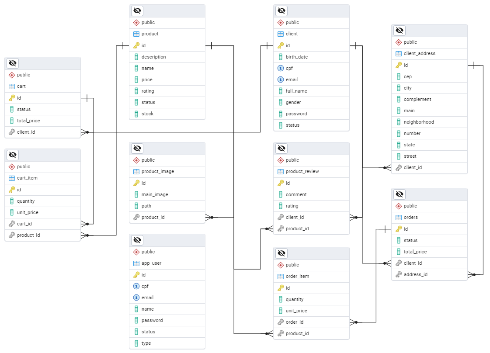

# 🖼️ Art in Life — E-commerce de Quadros (Spring Boot + PostgreSQL)

Este é o projeto backend de um e-commerce de quadros decorativos, desenvolvido com **Spring Boot 3.4.4** e **PostgreSQL**, seguindo uma arquitetura em camadas com foco em organização, extensibilidade e boas práticas.

---

## ✅ Funcionalidades Principais

- Cadastro e login de **clientes** (com e-mail e senha);
- Clientes possuem:
  - Nome completo, data de nascimento e gênero;
  - CPF (validação no frontend);
  - Endereço de faturamento obrigatório;
  - Podem ter múltiplos endereços, com um marcado como principal;
- Cadastro de **AppUsers** com roles específicas:
  - `ADMIN`: acesso total ao painel de controle;
  - `STOCKER`: acesso apenas à gestão de estoque;
- Produtos:
  - Várias imagens por produto (uma marcada como principal);
  - Classificação com estrelas (1 a 5);
- Cálculo de frete baseado no **CEP** do cliente (integração futura);
- Carrinho:
  - Pode existir sem login;
  - Armazenado no navegador;
  - Total calculado dinamicamente;
- Pedido:
  - Gerado a partir dos itens do carrinho;
  - Cliente pode acompanhar seus pedidos;
- Upload de imagens salvo em uma pasta física (`/images`);
- Clientes e produtos **não são excluídos**, apenas desativados;

---

## 🔐 Controle de Acesso

- Área `/admin/**`:
  - Restrita a usuários com roles `ADMIN` e `STOCKER`;
  - Estoquistas têm acesso limitado apenas à área de estoque;
- Cadastro e login de clientes separados dos usuários administrativos;

---

## 📦 Entidades

| Entidade         | Descrição                                        |
|------------------|--------------------------------------------------|
| `AppUser`        | Usuários administrativos (ADMIN, STOCKER)        |
| `Client`         | Cliente que realiza compras                      |
| `ClientAddress`  | Endereços do cliente com flag de principal       |
| `Product`        | Produto à venda                                  |
| `ProductImage`   | Imagens do produto                               |
| `Rating`         | Avaliações dos produtos com estrelas             |
| `Cart`           | Carrinho de compras                              |
| `CartItem`       | Itens no carrinho                                |
| `Order`          | Pedido gerado a partir do carrinho               |
| `OrderItem`      | Itens do pedido                                  |

---

## 📂 Estrutura de Pacotes

```
src/main/java/com/br/pi4/artinlife/
├── config/        # Configurações do Spring (segurança, uploads)
├── controller/    # Controllers
├── dto/           # Data Transfer Objects (validação de entrada)
├── entity/        # Entidades JPA
├── repository/    # Repositórios Spring Data JPA
├── service/       # Lógica de negócio
├── util/          # Utilitários
├── exception/     # Tratamento de exceções customizadas
```

---

## 🛡️ Segurança

A segurança padrão foi temporariamente desabilitada durante o desenvolvimento com:

```java
http.authorizeHttpRequests(auth -> auth.anyRequest().permitAll())
    .formLogin(form -> form.disable())
    .httpBasic(basic -> basic.disable());
```

---

## 🖼️ Upload de Imagens

- Imagens são salvas localmente na pasta `/images`;
- Apenas o caminho da imagem é salvo no banco de dados;
- A configuração de acesso público é feita via `WebMvcConfigurer`;

---

## 🗺️ Diagrama das Entidades



> Representação visual das relações entre as entidades principais do sistema.

---

## 🚀 Como rodar

1. Configure o banco PostgreSQL em `application.properties`;
2. Compile e execute o projeto com Spring Boot;
3. Acesse `http://localhost:8080` (sem autenticação obrigatória no momento);

---

## 📈 Status do Projeto

✔️ Entidades implementadas  
✔️ DTOs com validações  
✔️ Services com regras de negócio  
🚧 Controllers em desenvolvimento conforme o frontend evolui  

---

> Este README será atualizado conforme o projeto evoluir.
